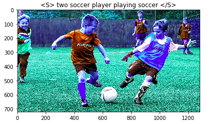
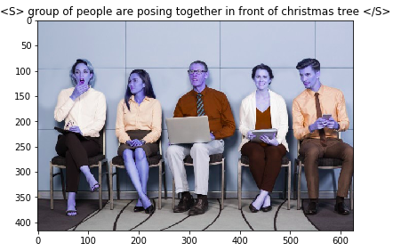
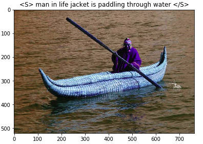

# Image Caption Generator
Implementation of 'merge' architecture for generating image caption from paper "What is the Role of Recurrent Neural Networks (RNNs) in an Image Caption Generator?" using Keras. Dataset used is Flickr8k available on Kaggle.

### Some sample captions that are generated
1       	  | 2		| 	3             
:-------------------------:|:-------------------------:|:------------------------:
  |  		|  

## Getting Started
Here I will explain about the 'merge' architecture that is used for generation image caption. You can run the train and run model using [notebook](https://github.com/adityajn105/image-caption-bot/blob/master/Image-Captioning-Bot.ipynb). I will also try to explain BEAM search and BLEU score in brief.

### Prerequisites
You will need Python 3.X.X with some packages which you can install direclty using requirements.txt.
> pip install -r requirements.txt

### Get the Dataset
I have used flickr8k dataset that is available on kaggle. You can run [download_data.sh](https://github.com/adityajn105/image-caption-bot/blob/master/download_data.sh) shell script. Before that put kaggle.json which is kaggle api key in same directory.

## Generating Image Caption
In neural image captioning systems, a recurrent neural network (RNN) is typically viewed as the primary ‘generation’ component. This view suggests that the image features should be ‘injected’ into the RNN. This is in fact the dominant view in the literature. Alternatively, the RNN can instead be viewed as only encoding the previously generated words. This view suggests that the RNN should only be used to encode linguistic features and that only the final representation should be ‘merged’ with the image features at a later stage. Here I will explain 'merge' architecture.

This architecture keeps the encoding of linguistic and perceptual features separate, merging them in a later multimodal layer, at which point predictions are made. In this type of model, the RNN is functioning primarily as an encoder of sequences of word embeddings, with the visual features merged with the linguistic features in a later, multimodal layer. This multimodal layer is the one that drives the generation process since the RNN never sees the image and hence would not be able to direct the generation process.

In this model, RNN is only used as language model. RNN is feeded the word embeddings of partial caption starting from special token 'seq_start', the RNN then generate encoded representation of partial sequence. While CNN is feeded the image, which generate a image representation.
These two representation i.e. language feature and image feature are appended together and feeded into another Feed Forward neural network. This FNN will output a vector of size equal to size of vocabulary. Index of highest value in that vector represents the next word of caption which is combined with the partial caption and again process continues untill we get the 'seq_end' token from FNN.

According to the paper, ["What is the Role of Recurrent Neural Networks (RNNs) in an Image Caption Generator?"](https://arxiv.org/pdf/1708.02043.pdf), in general, for image captioning task it is better to have a RNN that only performs word encoding. In short for generation task, involving sequence it is a better idea to have a separate network to encode each input data rather than to give everything to the RNN.

## Architecuture used in Notebook:

## Beam Search

## BLEU Score

## Authors
* Aditya Jain : [Portfolio](https://adityajain.me)

## Licence
This project is licensed under the MIT License - see the [LICENSE.md](https://github.com/adityajn105/image-caption-bot/blob/master/LICENSE) file for details

## Must Read
1. [What is the Role of Recurrent Neural Networks (RNNs) in an Image Caption Generator?](https://arxiv.org/pdf/1708.02043.pdf) 
2. [Vinyals, Oriol, et al. Show and tell: A neural image caption generator. CVPR, 2015.](https://arxiv.org/pdf/1411.4555.pdf)
3. [Xu, Kelvin, et al. Show, attend and tell: Neural image caption generation with visual attention. ICML, 2015.](http://proceedings.mlr.press/v37/xuc15.pdf)
4. [A great tutoria by Jason Brownlee to get started.](https://machinelearningmastery.com/develop-a-deep-learning-caption-generation-model-in-python/)